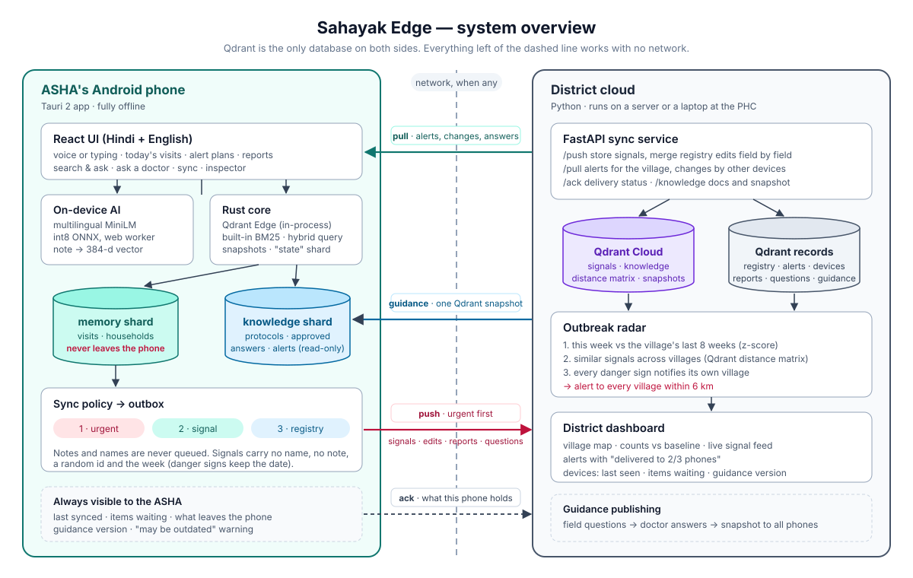
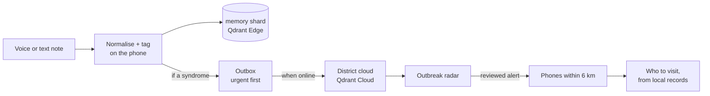

# Sahayak Edge

[](https://github.com/vaibhavdes/ASHASahayakEdge/releases/tag/latest-build)
[](https://qdrant.tech/edge/)

An offline-first Android app for ASHA health workers, built on **Qdrant Edge**. She speaks or types visit notes in Hindi, Hinglish or English; the phone understands them, keeps them searchable with no network and tells her whom to visit. The district receives name-free symptom signals, spots outbreaks and sends guidance back.

Code Cubicle 6.0 · Problem Statement 03: AI-Powered Edge Memory & Intelligence Platform

## The problem

An ASHA is the first health worker most rural families see: over 10 lakh of them, each caring for about a thousand people [1].

- **Too many apps, entered twice.** One ASHA manages seven apps plus WhatsApp groups, writes everything on paper and again online, and spends 20–30 minutes per person on slow phones and paid data [1].
- **Outbreaks are reported late.** 44% of measles outbreaks reported to IDSP in 2019–2023 arrived more than a week after onset [2].
- **Need is highest where the network is worst.** Maternal mortality is 87 per lakh births nationally but 154 in Uttar Pradesh [3]; rural India has 48 internet subscriptions per 100 people, against 127 in cities [4].

She needs a memory that lives on the phone, understands how she writes, and shares only what the health system needs.

## Try the demo

| Step | Do this | You should see |
|---|---|---|
| 1 | Install the APK from [Releases → latest-build](https://github.com/vaibhavdes/ASHASahayakEdge/releases/tag/latest-build) (arm64 Android) | |
| 2 | Open it with internet on and enter a name | Area picked from GPS (default Mumbai · Dharavi), no account or code. One-time AI download (~120 MB) |
| 3 | Home → **Try with a sample family** | A fictional pregnant mother, a 3-year-old and the father |
| 4 | Record a visit for the mother: `khoon aa raha hai aur sir dard` | Pregnancy danger sign, what to do, urgent signal queued |
| 5 | 📖 in the header → ask `saanp ne kaat liya`, then again in airplane mode | The approved answer, offline |
| 6 | **Sync**, then open the [district dashboard](https://sahayak-cloud-362605925833.asia-south1.run.app/dashboard/) | The signal arrives, with no name |

The app opens in Hindi; **EN / हि** in the header switches it to English. The chip icon opens **Under the hood** (the Qdrant Edge shards). The two-phone script with sync and conflicts is in the [evaluator runbook](docs/evaluator-runbook.md), and the [code guide](docs/code-guide.md) explains where each feature lives in the code.

**District backend** (FastAPI on Google Cloud Run, data in Qdrant Cloud)

| Link | What it shows |
|---|---|
| [Dashboard](https://sahayak-cloud-362605925833.asia-south1.run.app/dashboard/) | Village map, live signals, radar counts against baseline, alerts with delivery status, devices, reports, doctor questions, guidance publishing. Open to evaluators, no login |
| [API docs](https://sahayak-cloud-362605925833.asia-south1.run.app/docs) | Every endpoint: enroll, push/pull/ack sync, knowledge docs and (partial) snapshots, admin |

## What it does

**On the phone, fully offline**
- **Speak or type a visit.** On-device Hindi speech to text; notes are tagged as written (fever with rash, diarrhoea, jaundice, long cough; pregnancy, newborn and child danger signs), and "bukhar nahi hai" is not counted as fever.
- **Search by meaning.** "garbhvati mahila BP pichle hafte" becomes filters (pregnant, last 7 days) plus a meaning search; "similar past cases" works on any visit.
- **Know whom to visit today,** from her own records: danger signs to follow up, recent fever, pregnancies due or overdue a check, children due for vaccines.
- **Guidance that speaks.** 23 protocols and 13 approved answers ship in the app (danger signs, ORS, measles, TB, immunisation, snake and dog bite, burns, poisoning, heat stroke, pneumonia, malnutrition…), each ending with when to refer, with a Listen button.
- **Spot a rise before any sync,** by comparing this week with the past six weeks in her village.
- **Reports fill themselves:** the weekly IDSP S-form and a monthly summary are counted from her notes.

**Between phone and district**
- **Sync by itself** when the network returns, the app opens, and every ten minutes; on a slow connection urgent signals go first. Repeats never create duplicates.
- **Corrections propagate:** editing a visit withdraws its old signal.
- **Conflicts are shown, not overwritten:** the same field edited on two phones asks which to keep; different fields merge.
- **Ask a doctor** with a question she checks and redacts before sending.

**For the district**
- **Outbreak radar:** a rise against each area's last eight weeks, or in a new area a cluster that is unusual on its own (3 fever-with-rash or jaundice, 5 diarrhoea in a week), plus similar signals across areas with Qdrant's distance matrix. Alerts ask for human review and reach every village within 6 km, where each phone turns them into a visit list from records the district never sees.
- **Guidance publishing** from the dashboard reaches phones at their next sync as a Qdrant partial snapshot. The phone shows a progress strip while it downloads and a "New from the district" card afterwards; the new guidance then works offline. Doctors' answers to field questions go back to the phone that asked.

## How it works



**What leaves the phone**

| Record | Stays on the phone | Goes to |
|---|---|---|
| Visit note, exact GPS | Always | Nowhere |
| Symptom signal | | District: syndromes, age band, sex, week (date for danger signs), area, device ID. No name, no note. Danger signs go first |
| Family registry (names, members, pregnancy) | | Phones in the same area only; the area centre, not GPS |
| Reports, doctor questions | | District: counts only; questions after she edits them |

**A visit, end to end**



- **Normalise and tag.** "bukhar" also reads as "fever", and so do spellings like "bukar" or "bhukhar"; "खसरा का टीका" is a vaccine, not a rash. The note is embedded on the phone together with its tags, and stored with a BM25 vector and indexed details (village, date, age band, syndromes).
- **Search.** Dense + BM25 with filters (ACORN when several narrow filters combine), weighted RRF fusion, a recency decay formula, and MMR for variety.
- **Sync.** Push the outbox by priority; pull alerts, household changes and doctors' answers; fetch new guidance as a partial snapshot built from the phone's manifest; acknowledge what it now holds.
- **Answer safety.** Question framing ("… ko … kya karein?") is removed before matching; an approved answer needs 0.70 similarity and a shared medical term (0.90 without one). Unrelated protocols are not shown, so an uncovered question offers "ask a doctor" instead of a wrong answer.

**Qdrant is the only database.** The phone has three Qdrant Edge shards: `memory` (visits, never uploaded), `knowledge` (guidance and alerts, read-only) and `state` (households, outbox, settings as payload-only points). The cloud keeps signals and guidance as vector collections and the registry, enrollments, alerts, reports and questions as payload-only collections.

| Where | Qdrant feature | Purpose |
|---|---|---|
| Phone | Qdrant Edge 0.8 in-process, three shards | Private memory, district knowledge, app state |
| Phone | Named dense vector + built-in BM25 (multilingual, IDF) | Meaning and exact words (medicines, BP readings, names) |
| Phone | Prefetch + weighted RRF, exp-decay formula, MMR, recommend | Hybrid ranking, recency, variety, similar cases |
| Phone | Payload indexes, filters, ACORN, facets, count | Village/date/pregnancy filters, weekly summaries |
| Phone | int8 quantisation, on-disk storage, small WAL, batched import, daily optimise | Low-RAM phones |
| Phone | Snapshot unpack, full and partial recovery, manifest | District guidance updates |
| Cloud | Collections with the same layout, shard and partial snapshots | Guidance packaged for phones |
| Cloud | Distance-matrix API | Similar signals across villages |
| Cloud | Payload-only collections, filters, count, scroll | Registry, alerts, devices, reports, questions, with no SQL |

We use all four patterns from Qdrant's edge sync guide (snapshot initialisation, partial snapshots, dual write, async queue) [5], and add two it doesn't cover: field-level conflict handling and retraction of synced data.

## Results

**Search** (`eval/bench.py`): 318 synthetic visit notes in three languages, 32 queries (8 paraphrases sharing no words with any note), run on Qdrant Edge.

| Setup | Precision@5 | MRR | Paraphrases P@5 |
|---|---|---|---|
| Meaning only, raw notes | 0.67 | 0.73 | 0.75 |
| Keywords only (BM25), normalised | 0.80 | 0.85 | 0.33 |
| Hybrid 2:1, normalised | 0.88 | 0.93 | 0.75 |
| **Hybrid 2:1, normalised note + tags (shipped)** | **0.93** | **0.97** | **0.80** |

- The biggest gain came from the input, not the model: the Hindi/Hinglish lexicon and embedding each note with its tags.
- Keyword search alone fails on paraphrases, so both kinds of search are kept.
- The Qdrant query itself took under a millisecond on a laptop (embedding and UI excluded). The data is synthetic, so real-world gains will be smaller.

**Answers.** On unseen questions, right answers scored 0.76–0.98 and the closest wrong one 0.69 (then blocked). Of 20 field-style questions, each returned the right answer or protocol, and the two uncovered topics returned nothing.

**Sync.** int8 vectors cut each signal to about a tenth of its size; a test sync of 19 signals with alerts and household updates took under a second.

## Problem statement coverage

| PS03 goal | Sahayak Edge |
|---|---|
| Searchable semantic memory on the device | Visits and guidance in Qdrant Edge shards, dense + BM25 |
| Low-latency vector and hybrid search offline | Filtered, recency-aware hybrid search in under a millisecond |
| Decide what stays local and what syncs | Per-record sync rules (table above) with automatic slow-network priority |
| Intermittent connectivity | Everything works offline; automatic sync with a priority queue |
| Sync with Qdrant Server | Signals, registry and snapshots with Qdrant Cloud; delivery acks |
| Evolving memory and conflicts | Edits with retraction, versioned guidance with expiry, field-level merge |
| Interface for memory, search, sync and activity | Home, Families, Visit, Search, Sync, Under the hood, plus the district dashboard |
| A meaningful edge-to-cloud workflow | Symptom signals → radar → reviewed alerts → local visit lists; field questions → approved answers |

## Technology

| Layer | Choice | Why |
|---|---|---|
| App | Tauri 2 (Android), React 19, TypeScript, Tailwind, Rust core with `qdrant-edge` 0.8 | Qdrant Edge is a Rust library; Tauri is Rust underneath with a web UI |
| On-device model | paraphrase-multilingual-MiniLM-L12-v2, int8 ONNX (~118 MB) via transformers.js | Runs on any Android phone without a GPU; same vectors as the cloud |
| Voice | Android SpeechRecognizer and TextToSpeech via our Kotlin plugin | Offline Hindi without shipping another model |
| Cloud | Python, FastAPI, Qdrant Cloud, fastembed, `qdrant-edge-py` for identical BM25 | Same model and tokeniser on both sides |
| Delivery | GitHub Actions builds the APK; Google Cloud Run hosts the district service | |

There is no LLM: ASHAs use low-cost phones, and rules plus embeddings are fast, predictable and explainable, which matters for health advice.

## Running it

<details>
<summary><b>Cloud, locally</b></summary>

```bash
cd cloud
python3 -m venv .venv && .venv/bin/pip install -r requirements.txt
cp .env.example .env    # QDRANT_URL and QDRANT_API_KEY for Qdrant Cloud
.venv/bin/uvicorn app.main:app --host 0.0.0.0 --port 8000
```

The dashboard opens at `http://localhost:8000` (with `ADMIN_TOKEN` unless `OPEN_DASHBOARD=true`). Startup creates empty collections and publishes the starter guidance (again when its version changes). Phones enroll with `ENROLL_CODE` unless `OPEN_ENROLLMENT=true`. Without Qdrant Cloud keys it uses local Qdrant and sends guidance as documents instead of snapshots.
</details>

<details>
<summary><b>Cloud, on Google Cloud Run</b></summary>

```bash
# Secret Manager (project codecubileproject) holds sahayak-qdrant-api-key,
# sahayak-enroll-code and sahayak-admin-token.
QDRANT_URL=https://YOUR-CLUSTER.cloud.qdrant.io ./cloud/deploy.sh
```

The script builds the image with Cloud Build (model included) and runs one instance in `asia-south1`. Phones register themselves and get a token bound to the device and its area, limited to 30 per network per hour; set `OPEN_ENROLLMENT=false` to require the shared code. The dashboard is open during evaluation; set `OPEN_DASHBOARD=false` to require the admin token. Keys never go in Git or the APK.
</details>

<details>
<summary><b>App in a browser (UI work)</b></summary>

```bash
cd app && npm install && npm run dev
```

Qdrant Edge runs only in the Android app, so the browser uses a stand-in store; everything else is real.
</details>

<details>
<summary><b>Android</b></summary>

```bash
cd app
npx tauri icon app-icon.png
npm run android:init
npm run android:dev
```

Needs Rust with the `aarch64-linux-android` target, the Android SDK with NDK 27, and Java 17+. Every push to `main` builds an APK into the **latest-build** release, pointed at the evaluator Cloud Run URL.
</details>

## Limits and next steps

- **Field testing:** timings are from a laptop and the data is synthetic; both need real phones and consented notes.
- **Security for real use:** staff identity instead of open enrollment and an open dashboard, encryption at rest, an app PIN for shared phones, doctor logins, encrypted backup.
- **Voice:** on-device Hindi depends on the phone maker; a bundled Vosk model (~50 MB) would guarantee it.
- **ASHA workflow:** newborn visit schedules after delivery, a Village Health & Nutrition Day list, vaccine due dates from date of birth.
- **Government systems:** exchange data with U-WIN, RCH and ABHA through ABDM instead of adding another register.

## License

Code under the [MIT License](LICENSE). The embedding model is Apache-2.0.

## Data, credits and sources

The app and the cloud start empty; there is no preloaded patient data. `data/` holds only what they run on (areas, Hindi/Hinglish vocabulary, starter guidance). The synthetic notes behind the search benchmark live separately in `eval/` (`eval/generate.py`), and the in-app sample family is fictional. Guidance texts summarise public MoHFW and WHO material; the app supports, and doesn't replace, clinical judgement.

Built with [Qdrant Edge and Qdrant Cloud](https://qdrant.tech/edge/), [Tauri](https://tauri.app), [transformers.js](https://github.com/huggingface/transformers.js), [ONNX Runtime](https://onnxruntime.ai), [fastembed](https://github.com/qdrant/fastembed), [paraphrase-multilingual-MiniLM-L12-v2](https://huggingface.co/sentence-transformers/paraphrase-multilingual-MiniLM-L12-v2) (Apache-2.0), FastAPI, React, Tailwind CSS and lucide icons.

1. "India's Digital Health Push Is Overworking Its Front-Line Women", New Lines Magazine, 31 Mar 2026. https://newlinesmag.com/reportage/indias-digital-health-push-is-overworking-its-front-line-women/
2. "Analysis of measles outbreaks reported to IDSP, India, 2019–2023", BMC Infectious Diseases, 18 Aug 2026. https://pmc.ncbi.nlm.nih.gov/articles/PMC13536584/
3. SRS Special Bulletin on Maternal Mortality in India 2022–24, Office of the Registrar General. https://censusindia.gov.in/nada/index.php/catalog/47151
4. "India crosses 1.09 billion internet users, but the rural digital divide persists", The Week, 23 Jun 2026 (TRAI data, March 2026). https://www.theweek.in/news/biz-tech/2026/06/23/india-telecom-growth-digital-divide.html
5. Qdrant Edge data synchronization patterns. https://qdrant.tech/documentation/edge/edge-data-synchronization-patterns/
